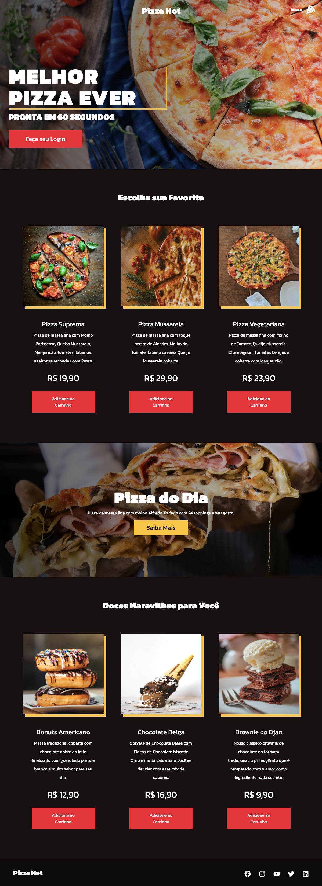

# Hiring Coders - Challenge - 02 (Product Page)

    

## About:
This landing page was developed as part of the second challenge of Hiring Coders program of Gama Academy / VTEX. The objective of this project consited on create an e-commerce product page with ReactJs and save the data of an user form and the products choosed by the user at the LocalStorage of the webpage.

## Preview:

  

## Credits:
* [Unplash](https://unsplash.com/s/photos/space-rocket)
